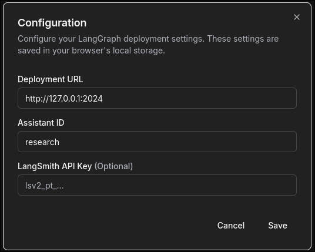

# LLM Research Agent

A deep research agent focusing on LLM research

## Starting and Running

### Configure your `.env` file

Copy over `.env.example` to `.env` and fill in the required environment variables.

### Start the LangGraph server

```bash
. .venv/bin/activate
langgraph dev
```

### Start the DeepAgents UI

```bash
cd webapp
yarn install
yarn dev
```

### Configuring the DeepAgents UI connection

Use `http://127.0.0.1:2024` as the deployment URL and `research` as the assistant ID.



## References

- [LangGraph local server](https://langchain-ai.github.io/langgraph/tutorials/langgraph-platform/local-server/#5-launch-langgraph-server)
- [DeepAgents UI](https://github.com/langchain-ai/deep-agents-ui)
- [LangChain DeepAgents](https://github.com/langchain-ai/deepagents)
- [Awesome MCP servers](https://github.com/punkpeye/awesome-mcp-servers)
- [LangChain MCP adappters](https://github.com/langchain-ai/langchain-mcp-adapters)

### LangGraph

- [LangGraph dev](https://langchain-ai.github.io/langgraph/tutorials/langgraph-platform/local-server/#2-create-a-langgraph-app)
- [LangGraph JSON config](https://docs.langchain.com/oss/python/langgraph/application-structure)

### Python Usefulness

- [asyncio-task](https://docs.python.org/3/library/asyncio-task.html)
- [with unboxing](https://peps.python.org/pep-0343/#specification-the-with-statement)
